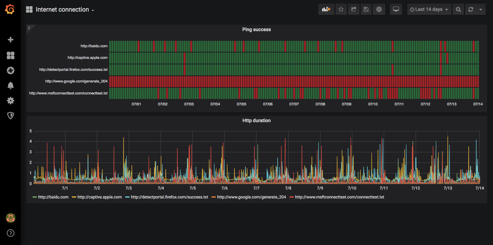

# docker container and system monitoring

a docker-compose quickstart for docker container and system monitoring

## tech stack

* docker/docker-compose
* prometheus
* node-exporter
* cadvisor
* grafana

## setup

```
$ docker-compose up
```

## login

```
http://localhost:3000
admin/admin
```

## debug

* http://localhost:9090/targets - shows status of monitored targets as seen from prometheus


## screenshots

* dashboard for internet-exporter


## refs

### docker-compose stack

* https://github.com/vegasbrianc/prometheus
* https://github.com/stefanprodan/dockprom

### dashboard

* https://grafana.com/grafana/dashboards/893
* https://grafana.com/grafana/dashboards/179
* https://grafana.com/grafana/dashboards/11277
* https://grafana.com/grafana/dashboards/42171

